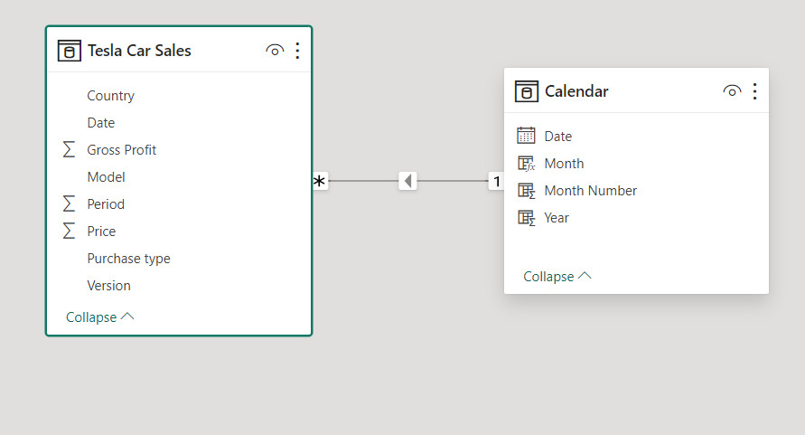

# Tesla Car Sales Analysis (January 2016 - December 2017)

## Introduction

In this project, we aim to analyze Tesla car sales data for the period of January 2016 to December 2017. Tesla, known for its innovative electric vehicles, has gained significant traction in the automotive industry during this period. By leveraging data analysis and visualization techniques, we seek to gain insights into various aspects of Tesla car sales, including trends in sales, popular models and versions, geographical distribution, purchase types, and profitability. There were no use cases for this project so I designed the use cases myself after applying critical thinking skills.

## Problem Statement

After applying critical thinking skills, I developed the following use cases which would help with the analysis.

1. **Sales Performance Analysis:** Analyze the overall sales performance, identifying trends and peak months of each year.
2. **Popular Models Identification:** Determine which Tesla models were the most popular among customers.
3. **Preferred Version Analysis:** Identify the distribution of different versions of Tesla cars sold.
4. **Geographical Analysis:** Analyze the distribution of Tesla car sales across different countries.
5. **Purchase Type Analysis:** Examine the distribution of sales based on purchase types. 
6. **Comparison analysis:** Find out which year produced the best result in terms of sales and profit.
7. **Profitability Assessment:** Assess the gross profit generated from Tesla car sales and identify factors influencing profitability.

## Data Sourcing

The data was download from [kaggle.com](https://www.kaggle.com) in Excel Workbook format. The dataset contained only 1 table or worksheet with 85,592 rows and 7 columns.

## Data Cleaning and Preprocessing

The data was assessed and cleaned on Microsoft Excel. 
The processes included:
- Handling missing values
- Validating Data types
- Data transformation and analysis

I noticed that the column `Period` which happens to be the date column contained numeric values so, I had to convert the values into short dates using `IF()` conditional statement.

I created a new column labeled `Date`. Then, I extracted the names of the months with the corresponding year from the `Period` column into the new `Date` column.

Below is a screenshot of the presentation:

After IF() function was executed to extract the date:

Next, I exported the data into Power BI for modeling, visualization, and detailed analysis.

# Power BI

## Data Analysis Expression (DAX) Concepts

As a standard procedure for me, whenever I am working with data which has dates, I would use the DAX function in Power BI to create a new date table to aid with time intelligence analysis instead of using the original date columns which may have some limitations. I created the new date table labeled `Calendar`, with the column name `Date`. Below is the DAX formula I used to create the date table.

I also created a new column labeled `Year` and extracted all the years from the `Date` column of the `Calendar` table. Below is the DAX function I used to extract the years.

I created two more columns and extracted the **number of the months** and **month name with year** from the date into each column respectively.

###### _Month Number DAX formula_

###### _Month Name with year DAX formula_

### Additional Measures

- I developed a measure to calculate the production cost. Below is a screenshot of the formula: 

- I also developed another measure to account for the gross margin rate (%). Below is the screenshot of the formula:

## Data Modeling 

I established a relationship between the new and previous tables by using Power BI's data modeling tool. I connected the two tables using the date columns which were identical and a star schema (1:*) relationship was established. Below is a preview of the data model.

## Data Visualization 

- **Homepage of report**

- **Tesla Model X Page**

- **Model S Page**

You can interact with the report by [clicking here](https://app.powerbi.com/view?r=eyJrIjoiMWI5YzFhZjAtMDUzOS00MTI5LWE1YTYtZDU4ZDlmYjU0Y2M4IiwidCI6ImZkMjljODFlLWI1YzUtNDAzNS1hZGIyLTBmMGJjODhiMzM2NyJ9)

## Analysis

1. The peak months of sales in 2016 and 2017 were April ($283.42M) and July ($282.85M) respectively. 

2. Model X happened to be the popular model with the total sales of $3.56 billion.

3. The distribution of sales by version highlights the dominance of certain models, such as the P90D and 75 RWD. In Mar-2016, the version P90D made up 3.81% of sales amounting to $2.49 billion.

4. The US and Germany accounted for significant portions of sales revenue. US accounted for $4.78 billion sales whiles Germany’s, $1.28 billion.

5. The majority of sales were through deposits accounting for $3.47 billion out of the total $6.44 billion sales revenue.

6. In 2016, the total sales was $3.25 billion and profit being $949.41 million, whereas, in 2017, sales was $3.19 billion and profit being $928.95 million. From the distribution, 2016 produced the best result in terms of sales and profit.

7. Total gross profit was $1.88 billion with the margin of 29.16% growth.

## Recommendations

1. Understanding the factors contributing to the peaks of sales can help to optimize sales strategies during next periods. There weren’t many variables to measure what could influence sales but taking into consideration, factors like; color, budget, charging infrastructure, technology, performance, warranty, customer reviews, test drives, etc. could lead to the peaks.

2. Model X emerged as the most popular model, indicating potential areas for further investment and marketing efforts.

3. Looking at the dominance of versions like P90D and 75 RWD, this insight can guide inventory management and production planning to meet customer demand effectively. Despite the popularity of certain versions, it is crucial to monitor and adapt to shifts in consumer preferences over time.

4. Though US and Germany represent strong market presence however, exploring opportunities for expansion in regions like Australia, where sales are comparatively lower, could be beneficial too.

5. Deposit payment type indicates a preference among customers. Offering flexible payment plans or incentives could further boost sales volume. On the other hand, Cash purchases also represent a substantial portion of sales, indicating the importance of catering to customers who prefer outright purchases.

6. Despite a slight decrease in sales from 2016 to 2017, maintaining profitability is key. Identifying cost-saving measures or revenue-enhancing strategies can help improve overall financial performance.

7. Achieving a gross profit margin of 29.16% indicates healthy profitability. Continuously monitoring and optimizing cost structures can help maintain or improve profit margins over time.

## Conclusion

The analysis of Tesla car sales data for the period of 2016 to 2017 has provided valuable insights into various aspects of sales performance, including model popularity, version distribution, geographical trends, purchase preferences, and financial metrics. Leveraging these insights, Tesla can strategize effectively to capitalize on strengths, address weaknesses, and grab opportunities for growth and improvement in the dynamic automotive market. By focusing on areas such as customer preferences, market expansion, and profitability optimization, Tesla can enhance its competitive position and drive sustainable success in the electric vehicle industry.

***

###### Thank you for your time!
